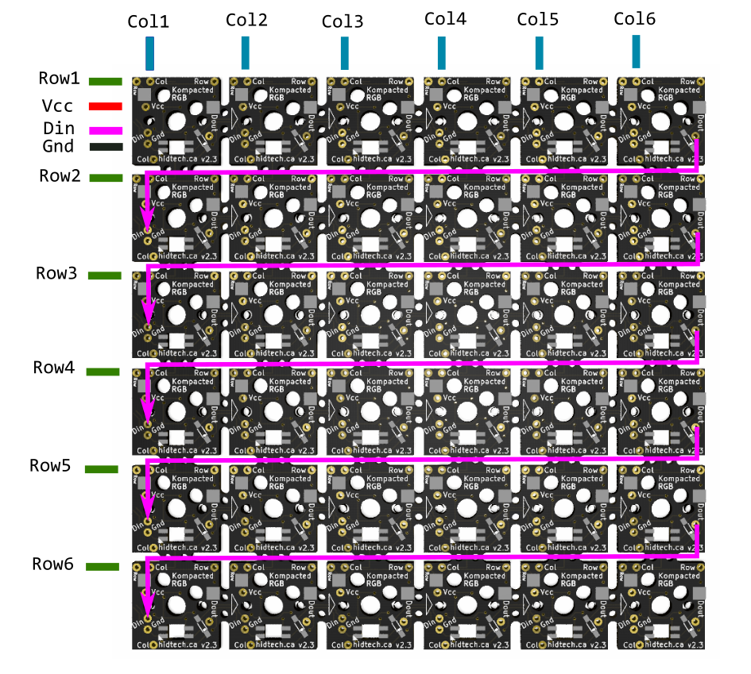

This is a very rushed github. No guarantees

## Hotswap PCBs:

The Hot-Swap PCBs are compatible with all ortholinear MX keyboard cases which use the standard 19.05mm spacing, and are break-away – make it any size you want !
Demo of the product in action: https://www.youtube.com/watch?v=ky6atAq7jCk

 

## Support:
- The Hot-Swap PCBs are made to be used with Kailh Hot-Swap Sockets for MX style switches and SK6812 Mini-E RGB leds
- The 1N4148 diode format is SMD 1206

 

## The rows and columns:

The board is 6 by 6, spaced by 19.05mm

All the rows and columns are connected in between them.
This means you only need to connect each column and row to your microcontroller once.
There are conveniently placed Row and Col pads on each switch PCB.

## The RGB:

It uses SK6812 mini-e.
All the Ground and Vcc of the leds are connected to each other. This means you need to connect Vcc and Gnd from the microcontroller to the PCB only once.
There are Gnd and Vcc pads on each switch.

For the signals – the SK6812 mini-e take one input signal, and output a signal (for the next LED).
Each rows has the signals of the LEDs wired together.
So if you’re using multiple rows, you just need to connect the output of the last led of each row, to the input of the first led of the next row. There are Din and Dout pads on each switch PCB.

 

## The breakaway:

This board was designed to be breakable. It can be broken down into any dimension from 1×1 to 6×6.
The Gnd, Vcc, Rows and cols, and RGB will work exactly the same.

 

## Wiring example for a 6×6 board:

This work is licensed under a Creative Commons Attribution-NonCommercial-ShareAlike 4.0 International License.
